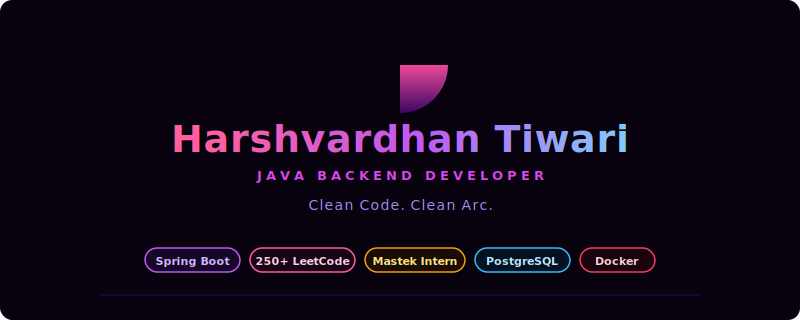
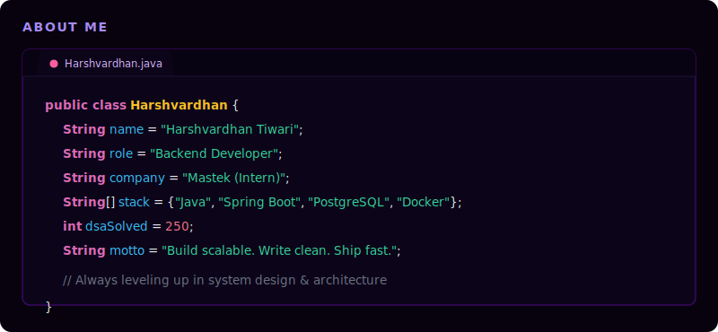
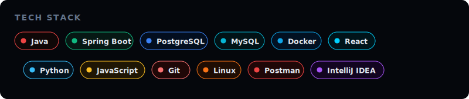
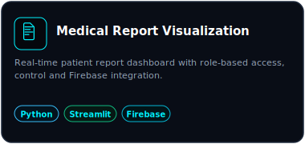
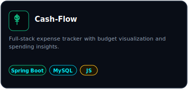
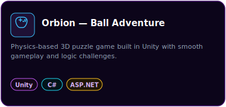
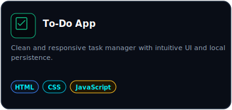
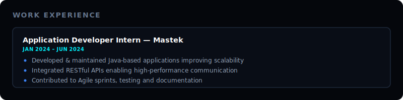
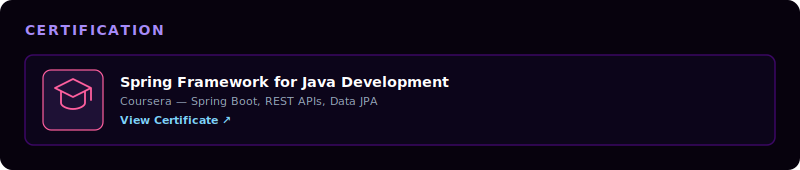
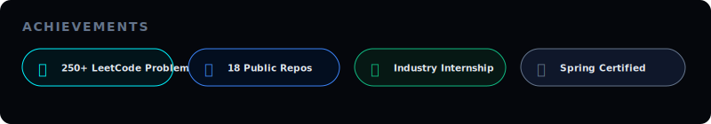

<!-- ══════════════════════════════════════════════════════════ -->
<!--      HARSHVARDHAN TIWARI — GITHUB PROFILE README v4      -->
<!-- ══════════════════════════════════════════════════════════ -->

<!-- Header Section (Sunset, Name, Highlights) -->

 

<!-- About Me (Mock IDE Window) -->

 

<!-- Tech Stack Grid -->

  

<!-- Featured Projects Section -->
<h3 align="left">&nbsp;&nbsp;🚀 FEATURED PROJECTS</h3>
<table width="100%" border="0" cellspacing="0" cellpadding="8" style="border-collapse: collapse;">
  <tr>
    <td width="50%" align="center" style="padding: 6px;">
      
    </td>
    <td width="50%" align="center" style="padding: 6px;">
      
    </td>
  </tr>
  <tr>
    <td width="50%" align="center" style="padding: 6px;">
      
    </td>
    <td width="50%" align="center" style="padding: 6px;">
      
    </td>
  </tr>
</table>

 

<!-- Work Experience Card -->

 

<!-- Certification Card -->

 

<!-- Achievements Card -->

  

<!-- GitHub Stats Section -->
<h3 align="left">&nbsp;&nbsp;📊 GITHUB STATS</h3>

<!-- Snake Grid Contribution Graph -->

  

 

<!-- Connect Section -->
<h3 align="left">&nbsp;&nbsp;🌐 CONNECT</h3>

  
  
  
  

<!-- Footer -->

  
   
  <em>✦ Crafted with passion & Java ☕ · Harshvardhan Tiwari ✦</em>

